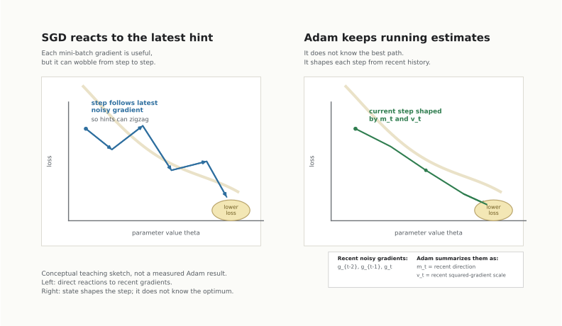

# Why Adam Exists

Adam is an optimizer. It decides how to change a model's parameters after the training code measures a gradient.

The Adam paper starts from a common training problem: we have a scalar objective function, often called a loss, and we want to adjust many parameters so that this objective gets smaller. If the objective is differentiable, a first-order optimizer can use gradients. A gradient is a vector of local hints: each entry says how the loss would change if one parameter moved a little.

In the paper's notation, `theta` is the parameter vector and `f(theta)` is the objective. A training step changes `theta`.

## The Hint Is Useful, But It Is Noisy

Large training runs often use mini-batches. The paper writes the stochastic objective at timestep `t` as `f_t(theta)`.

The gradient from one mini-batch is useful, but it may not point exactly where the full dataset would point. Plain stochastic gradient descent has to use the current hint while also living with its noise.

<figure>
  
  <figcaption>A qualitative sketch of the motivation: a single mini-batch gradient can be useful and still wobble.</figcaption>
</figure>

## A Tiny One-Parameter Example

Imagine there is only one parameter, a knob called `theta`. The loss is lower when the knob moves to the right, but each mini-batch gives a slightly different hint.

| Step | Mini-batch hint | What a direct update might do |
|---:|---|---|
| 1 | "Move right a lot" | Big move right |
| 2 | "Move left a little" | Partial undo |
| 3 | "Move right" | Move right again |
| 4 | "Move right, but carefully" | Smaller move right |

The current gradient is information, not certainty.

## Why High Dimensions Make This Worse

Real models have many parameters. Some coordinates get large, frequent gradient signals. Others get small or occasional signals. Sparse features make this concrete: a feature absent from the current mini-batch may give no useful update for its parameters at that step.

This is why one learning rate for every parameter, based only on the current gradient, can be too blunt.

## What Did People Do Before?

Before Adam, optimizers already tried to remember useful pieces of history:

| Method family | What it roughly tries to remember |
|---|---|
| Plain stochastic gradient descent | Nothing beyond the current gradient |
| Momentum-style methods | Recent direction |
| AdaGrad-style methods | Which coordinates have accumulated large squared gradients |
| RMSProp-style methods | A decaying recent history of squared gradients |

Adam combines a direction memory and a scale memory. The paper describes these as estimates of the first moment and second raw moment of the gradients.

The next section turns that motivation into the actual update loop.
